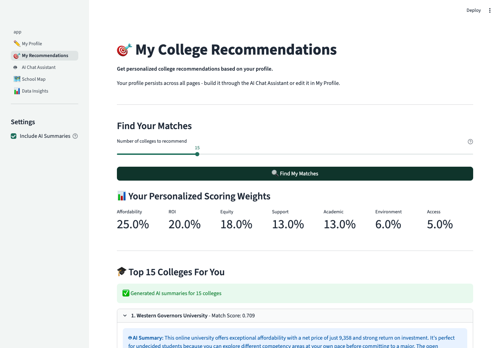
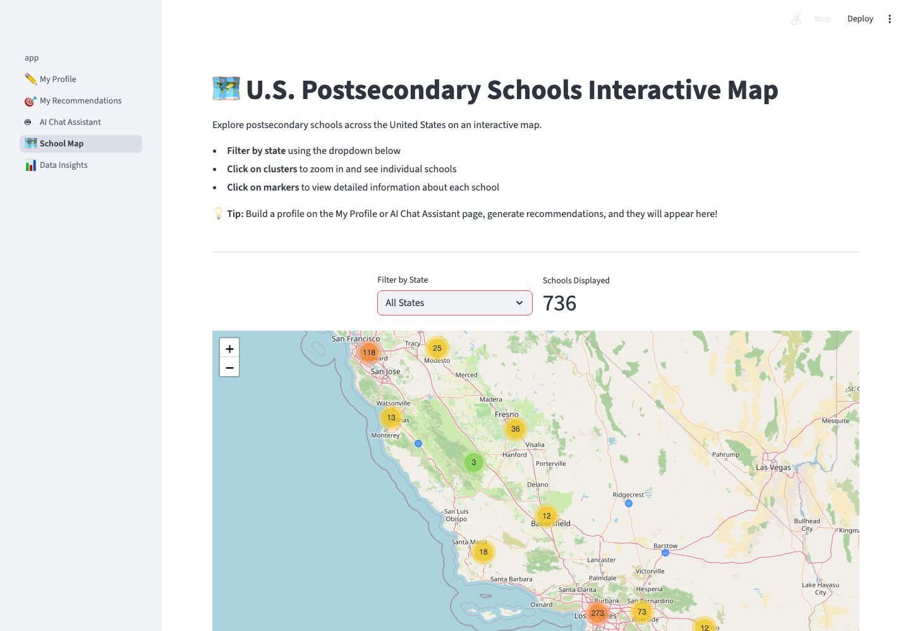
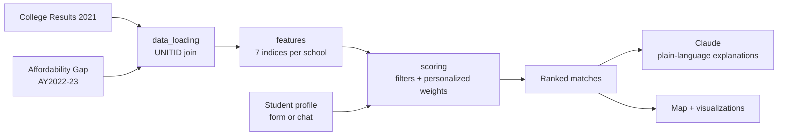

# EquiPath

**Equity-centered college matching for the students who need it most.**

🏆 First Place, Most Creative Project — Educational Equity Track (sponsored by Snowflake), 7th Annual Datathon for Social Good @ UC Berkeley

<!-- Once deployed: replace # with your Streamlit Cloud URL -->
**[Live demo](#)** · [Quick start](#quick-start) · [How the matching works](#how-the-matching-works) · [Architecture](#architecture)



## Why

College search tools rank schools by prestige. But for a first-generation student, a student-parent, or a student from a low-income family, the question isn't "what's the highest-ranked school I can get into" — it's "where will I actually graduate, without drowning in debt?"

The data says that question matters. In the federal datasets behind this project:

- Schools serving the highest-income students graduate **74.5%** of them in 6 years; schools serving the lowest-income students graduate **34.7%** — a 39.8-point gap.
- The median student-parent faces a **$26,931** annual affordability gap once childcare is factored in, nearly 3× the $9,610 gap for other students.
- Black students graduate at rates ~12 points below white students at the same set of institutions.

EquiPath flips the ranking: instead of prestige, it scores every U.S. institution on how likely *this specific student* is to afford it, be supported there, and graduate.

## What it does

A Streamlit app with five connected pages sharing one student profile:

| Page | What it does |
|---|---|
| **My Profile** | Structured form covering academics, budget, background, geography, and campus preferences |
| **AI Chat Assistant** | Builds the same profile conversationally, with optional voice input/output |
| **My Recommendations** | Ranks 4,933 institutions against your profile; Claude explains each match in plain language, and a Q&A chat answers follow-ups |
| **School Map** | 6,812 schools on an interactive map, filterable by state or by your recommendations |
| **Data Insights** | The income-vs-graduation-rate analysis that motivated the project |



## How the matching works

Every institution gets seven normalized scores, computed from federal data (no opinions, no rankings):

| Dimension | Default weight | Built from |
|---|---|---|
| Affordability | 25% | Net price + affordability gap (childcare-adjusted for student-parents) |
| ROI | 20% | Median earnings 10 years after entry vs. median debt of completers |
| Equity | 18% | Graduation rate *for the student's own demographic group* + cross-group parity |
| Support | 13% | Student-faculty ratio, instructional spend, endowment, Pell experience, retention |
| Academic fit | 13% | Program strength in the student's intended field, research intensity |
| Environment | 6% | Size/setting match + student-body diversity |
| Access | 5% | Admission likelihood given the student's GPA and test scores |

The weights adapt to the student — they're seeded from stated priorities and shift for circumstances (a student-parent's affordability score uses the childcare-adjusted gap; a first-gen student's support score amplifies high-support schools). Hard constraints (budget, in-state, institution type, minority-serving institution preference, distance from home zip code) filter before any scoring happens, and for-profit institutions are excluded by default.

Two design rules kept us honest:

1. **The algorithm decides, the AI explains.** Rankings come from deterministic, auditable scoring — Claude is only used to translate the numbers into plain language and answer questions about the results.
2. **Demographics only ever help.** Race/ethnicity is optional and used solely to surface the graduation rate for the student's own group and to match minority-serving institutions.

## Quick start

```bash
git clone https://github.com/AndreJustinLee/7thDatathon.git
cd 7thDatathon
pip install -r requirements.txt
streamlit run app.py
```

That's it — the datasets ship with the repo, and the first run builds a Parquet cache (~30 seconds; instant after that).

The AI features (match explanations, Q&A chat) are optional. To enable them:

```bash
cp .env.example .env   # then add your Anthropic API key
```

Run the tests with `pip install pytest && python -m pytest tests/`.

### Deploy your own

The app runs as-is on [Streamlit Community Cloud](https://share.streamlit.io) (free): point it at this repo with `app.py` as the entrypoint, and add `ANTHROPIC_API_KEY` under app secrets if you want the AI features.

## Data

| Source | Contents |
|---|---|
| College Results View 2021 (IPEDS/College Scorecard) | Graduation rates by race, earnings, debt, admissions, institutional characteristics for 6,289 institutions |
| Affordability Gap AY2022-23 | Net price and affordability gaps per institution across five family-income brackets, including student-parent scenarios with childcare costs |
| NCES Postsecondary School Locations 2022-23 | Coordinates for the 6,812 schools on the map |

The two tabular datasets are joined on UNITID (the federal institution ID) and filtered to the income bracket matching the student's family income, yielding one row per institution — 4,933 institutions with ~290 features.

## Architecture

```
app.py                     Streamlit entrypoint (landing page)
pages/                     The five app pages
src/
├── data_loading.py        Load + merge the datasets (Parquet-cached)
├── features.py            All feature engineering → the 7 base indices
├── profile.py             UserProfile dataclass + validation
├── scoring.py             Hard filters + personalized scoring + ranking
├── clustering.py          K-means institution archetypes
├── distance.py            Zip-code radius filtering
├── llm.py                 Claude explanations for ranked matches
├── chat.py                Conversational profile builder (+ voice)
├── profile_state.py       Shared profile across pages (session state)
├── profile_editor.py      Profile form UI
└── config.py              Environment/API-key handling
tests/                     Pipeline smoke tests
notebooks/                 EDA that shaped the scoring design
```



## Where this could go

- **Persistent profiles** — session state currently lives in memory, so a browser refresh starts over; a database plus lightweight auth would make profiles and saved searches durable.
- **A learned success model** — with outcome data (graduation, debt, earnings for students *like this one* at schools *like this one*), a supervised model could join the seven indices as an eighth, predictive score.
- **More data** — admission-rate coverage is ~35%; transfer pathways and campus support services (childcare, mental health) would sharpen the support index.

## Team

Built by **Alex Toohey, Andre Lee, Davyn Paringkoan, and Leo Zhang** for the 7th Annual Datathon for Social Good.

Data from the U.S. Department of Education (College Scorecard, IPEDS) and the Affordability Gap project. AI explanations powered by Anthropic's Claude.
